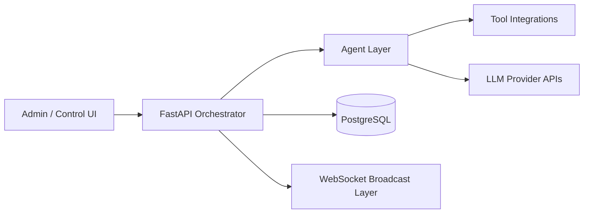
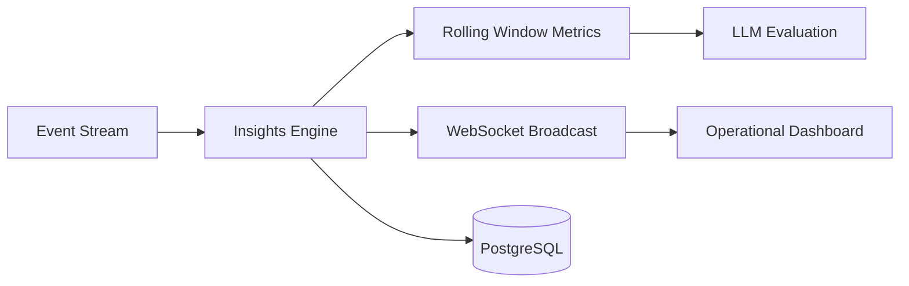

  

# Michael Palmer

AI Deployment & Solutions Specialist  
Automotive AI • Full-Stack Systems • Workflow Automation

  

---

## About

I design and deploy practical AI systems that integrate directly into real-world business workflows.  
My focus is applied AI — production-ready systems that improve operations, visibility, and decision-making.

Primary domains:
- Automotive retail intelligence
- AI-assisted workflow automation
- Multi-agent systems & orchestration
- Real-time operational dashboards
- Human-in-the-loop AI tooling

---

## Core Capabilities

### Primary Stack

  
  
  
  
  
  
  
  
  

### Platforms & Deployment

  
  
  

### Data & Services

  
  

### AI Tooling

  

---

## Selected Work

### [AgentHub](https://github.com/mpalmer79/AgentHub)
Centralized AI agent orchestration platform for building, testing, and deploying structured multi-agent workflows. Designed for scalable coordination, tool integration, and operational AI control layers.  
**Stack:** Python, FastAPI, WebSockets, OpenAI API, PostgreSQL

---

### [LivePulse – AI Insights Engine](https://github.com/mpalmer79/livepulse)
Real-time operational intelligence platform that ingests event streams, evaluates rolling metrics, and broadcasts AI-driven recommendations via WebSocket architecture.  
**Stack:** Python, FastAPI, WebSockets, React, PostgreSQL

---

### [Cyber Shield](https://github.com/mpalmer79/cyber-shield)
AI-powered cybersecurity simulation platform focused on phishing detection, social engineering awareness, and interactive training workflows.  
**Stack:** Next.js 14, React 18, TypeScript

---

### [ReplyGenius AI](https://github.com/mpalmer79/replygenius-ai)
AI-assisted communication drafting system built for structured, fast, and consistent response generation across professional workflows.  
**Stack:** TypeScript, OpenAI API

---

### [Pharma Rep Trainer](https://github.com/mpalmer79/pharma-rep-trainer)
AI-driven sales training and roleplay platform simulating pharmaceutical rep conversations, objection handling, and structured coaching feedback.  
**Stack:** Python, LLM Integration, Scenario Simulation Engine

---

### [AgentForge](https://github.com/mpalmer79/agentforge)
Agent experimentation sandbox for building and iterating on multi-step AI workflows and orchestration logic.  
**Stack:** Python, OpenAI API, Tool-Calling Frameworks

---

### [Quirk AI Kiosk – Automotive Showroom Platform](https://github.com/mpalmer79/quirk-ai-kiosk)
AI-powered automotive showroom kiosk enabling intelligent vehicle search, structured comparison logic, and real-time inventory integration.  
**Stack:** Next.js, TypeScript, API Integrations

---

## Architecture Overview

### AgentHub – Multi-Agent Orchestration

### LivePulse – Real-Time AI Insights Engine

---

## Operational Metrics

### AgentHub
- Multi-agent workflow execution with structured tool-calling
- Real-time orchestration via async FastAPI
- WebSocket broadcast architecture for live state updates
- Modular agent framework supporting scalable expansion

### LivePulse
- Rolling window metric evaluation engine
- Sub-second event ingestion pipeline
- Real-time dashboard broadcast architecture
- AI-driven recommendation layer integrated with operational data

### Cyber Shield
- Interactive phishing simulation workflows
- Scenario-based AI evaluation
- Structured training feedback loops

---

## System Design Principles

- Workflow-first design
- Reliability over novelty
- Composable architecture
- Event-driven real-time systems
- Human-in-the-loop AI
- Security-conscious engineering
- Built-in observability

---

## Production Readiness Standards

- Structured outputs for AI reliability  
- Safe tool execution & permission boundaries  
- Clear API/service boundaries  
- Secure secret management  
- Graceful failure handling  
- Operational logging & traceability  
- Maintainable, modular architecture  

---

## Philosophy

AI should:
- Reduce friction
- Increase clarity
- Integrate into existing workflows
- Deliver measurable operational lift

I build systems with that standard.

---

## Connect

